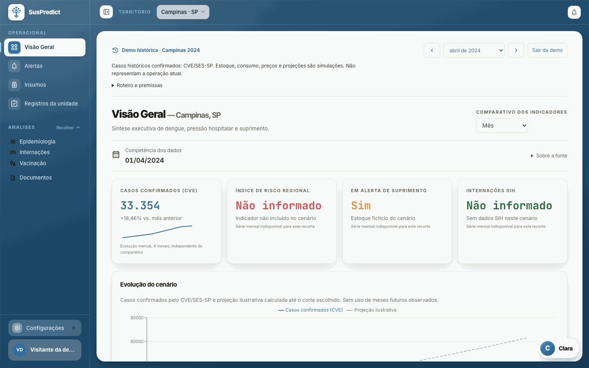
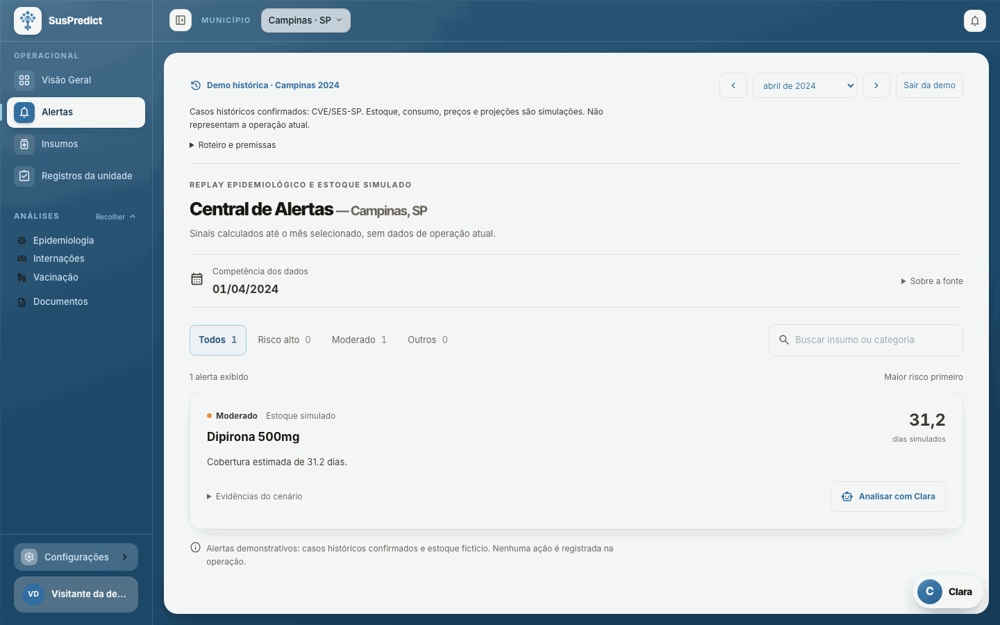
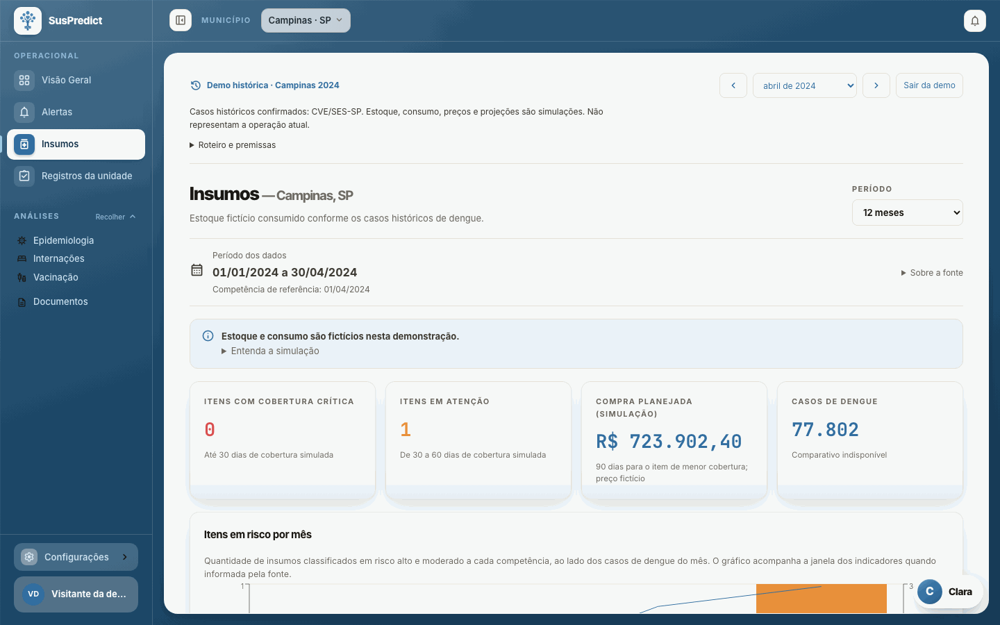
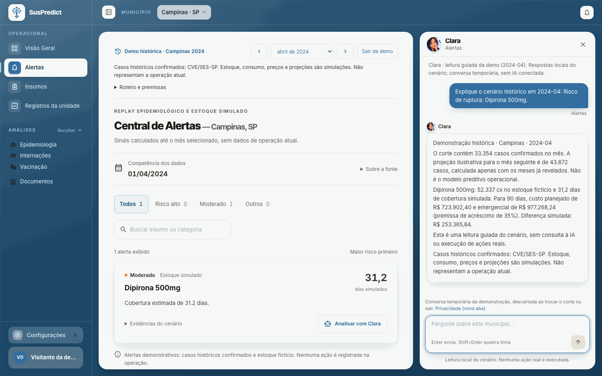
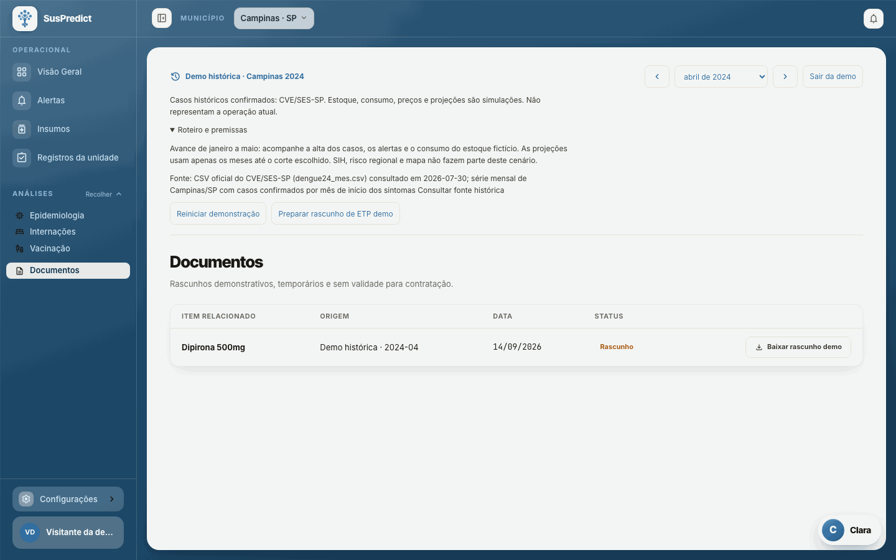
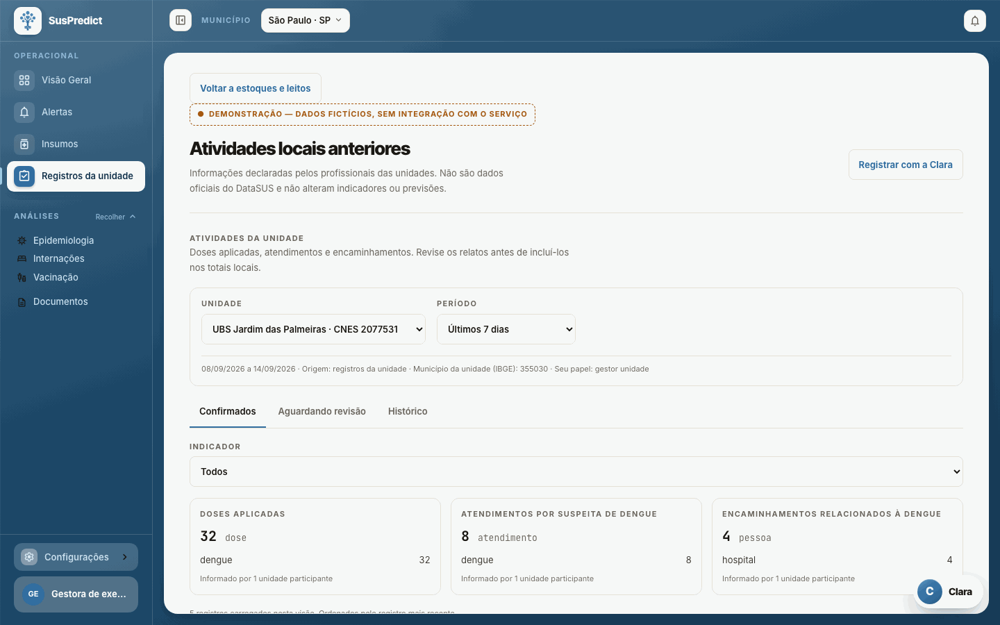
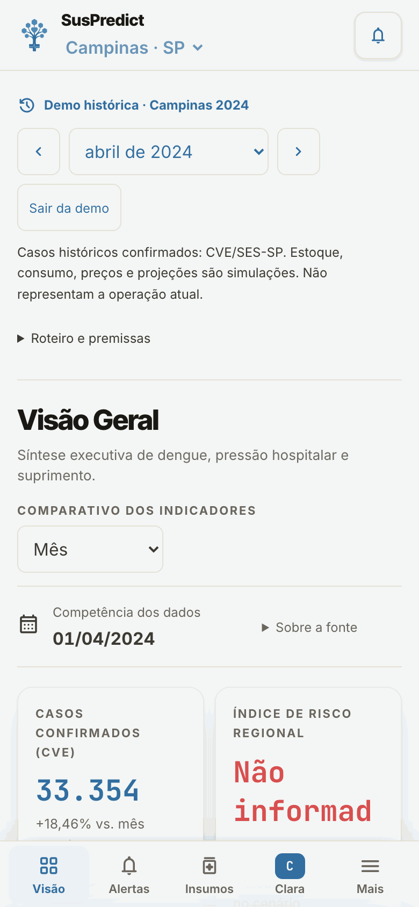
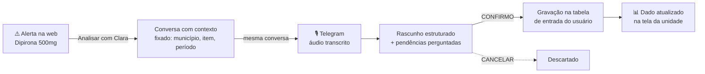
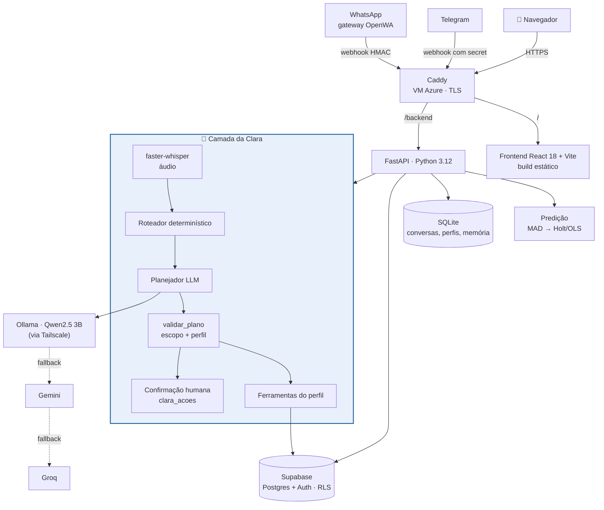

<div align="center">


# SUS Predict

**Antecedência para a gestão municipal de saúde: da alta de dengue ao rascunho de ETP, antes que o insumo falte.**


[Sistema em produção](https://suspredict.northcentralus.cloudapp.azure.com) ·
Vídeo pitch <!-- PREENCHER: link do vídeo pitch --> ·
[Como a Clara funciona](#clara-hub-conversacional) ·
[Arquitetura](#arquitetura) ·
[Time](#time)

</div>

> Projeto acadêmico de startup (TCC FIAP 2026). **MVP acadêmico funcional**, não um sistema
> pronto para produção: o SUS Predict **apoia** a decisão e não substitui gestor, profissional
> de saúde, validação jurídica nem os sistemas oficiais.

---

## O problema

A gestão de insumos no SUS é reativa: compra-se quando o estoque acaba. A compra emergencial
custa **30–40% a mais** <!-- PREENCHER: fonte do dado 30–40% -->, e a **Lei 14.133/2021** exige de
30 a 90 dias para licitar. Em 2024 o Brasil teve **6,9 milhões de casos de dengue**, recorde
<!-- PREENCHER: fonte do dado 6,9 mi -->. Na pesquisa de campo do grupo com **10 profissionais** de
secretarias paulistas, 100% já tiveram falta de medicamento, 90% não usam software de planejamento
e a maior dor citada (50%) foi **prever o consumo de insumos para comprar a tempo**.

## A solução

- **Sinal:** lê dados públicos curados (SINAN, SIH, compras públicas, vacinação) do município.
- **Risco:** detecta surto e projeta a série com Holt/OLS; cruza com compras públicas para apontar **risco de aquisição** por insumo.
- **Antecedência:** mostra a janela de decisão, com fonte e competência de cada número.
- **ETP:** a Clara redige o **rascunho** do Estudo Técnico Preliminar (Lei 14.133/2021, art. 18), que só é gerado após confirmação humana e sai em PDF.
- **Rotina da unidade:** a UBS relata vacinas, medicamentos, leitos e internações por conversa; nada grava sem confirmação.
- **Em qualquer canal:** a mesma conversa na web, no Telegram e no WhatsApp.

## Diferenciais

| Diferencial | Na prática |
|---|---|
| 3 canais, 1 conversa | Web, Telegram e WhatsApp retomam o mesmo `conversa_id`, com checagem de dono |
| Escrita só com confirmação humana | Rascunho primeiro; confirma na tela (web) ou com `CONFIRMO` (canais) |
| Números sempre de ferramenta | O LLM escolhe a ferramenta e redige; o número vem do dado consultado |
| Dado público real + previsão | Tabelas curadas de fontes do SUS + Holt/OLS com detecção de surto |
| LLM local com fallback | Qwen2.5 3B no Ollama → Gemini → Groq; a barreira de escopo vale para todos |
| Em produção com controles reais | Login com 2FA por e-mail, perfis por município, RLS no Supabase |

## Galeria de telas

Capturas feitas no **modo demo** (Campinas 2024, roda no navegador sem backend) e, em Registros
da unidade, com fixtures de desenvolvimento. **Os casos de dengue são históricos reais (CVE/SES-SP);
estoque, preços e economia são cenário demonstrativo fictício.**

| | |
|---|---|
|  |  |
| **Visão Geral** — abril/2024: casos confirmados, suprimento em alerta e evolução do cenário | **Alertas** — fila de risco com evidências e o botão "Analisar com Clara" |
|  |  |
| **Insumos** — cobertura simulada, compra planejada e casos no período | **Clara** — resposta com números do cenário e premissas explícitas |
|  |  |
| **Documentos** — rascunho de ETP da demo, sem validade para contratação | **Registros da unidade** — relatos da UBS, separados do dado oficial |

<details>
<summary><b>Mobile (390 px) e telas sem captura</b></summary>



- Epidemiologia <!-- PREENCHER: print da Epidemiologia (a demo não cobre a tela; exige backend ou fixture) -->

</details>

---

## Clara: hub conversacional

A Clara é um agente de **escopo fechado**: responde sobre os dados do município e sobre o próprio
sistema, e só escreve depois que uma pessoa confirma.



| Capacidade | Web | Telegram | WhatsApp |
|---|:---:|:---:|:---:|
| Consultas com ferramentas (estoque, alertas, epidemiologia, aquisições) | ✅ | ✅ | ✅ |
| Retomar a mesma conversa | ✅ | ✅ `/conversas` | ✅ lista numerada |
| Entrada por áudio (faster-whisper) | — | ✅ | ✅ |
| Registrar vacina, medicamento, leitos, internações por dengue | ✅ confirma na tela | ✅ `CONFIRMO` | ✅ `CONFIRMO` |
| Rascunho de ETP | ✅ confirma na tela | pede confirmação na web | pede confirmação na web |
| Receber o PDF do ETP | ✅ | ✅ | ✅ |
| Ver e apagar a memória | ✅ tela "O que a Clara sabe" | ✅ `/memoria`, `/esquecer` | ✅ `/memoria`, `/esquecer` |

### Regras de IA em vigor

1. **Escopo fechado:** pergunta clínica, conceitual ou social recebe recusa fixa gerada em código, sem LLM.
2. **Três barreiras de permissão:** o planejador só vê as ferramentas do perfil; o plano é validado no backend; o conjunto de ferramentas criado para a conversa só contém o permitido.
3. **Números só de ferramenta:** o LLM planeja (`chamar_ferramenta`, `responder`, `fora_do_escopo`) e redige; valores vêm do dado consultado.
4. **Confirmação humana antes de qualquer escrita:** propostas duráveis expiram em 24 h e só uma requisição executa.
5. **Formato rígido na escrita:** mesmo quando o Gemini extrai uma frase livre, o resultado passa pela mesma validação e confirmação.
6. **Recusa de dado identificável:** frase com dado identificável de paciente não é enviada à extração por Gemini.
7. **Memória não vira instrução:** cifrada (Fernet), limitada a nome, preferência e resumo filtrado; nunca entra no planejador nem na autorização; o usuário pode apagar.
8. **Dado local nunca é somado ao oficial:** registro da unidade é rotulado e fica separado do DATASUS.
9. **Fallback de LLM sem mistura:** Ollama → Gemini → Groq; se o modelo cai depois de começar a responder, a resposta é interrompida em vez de misturar modelos.

| Telegram | WhatsApp |
|---|---|
| <!-- PREENCHER: print do canal Telegram (conta de teste, sem dado real) --> | <!-- PREENCHER: print do canal WhatsApp (conta de teste, sem dado real) --> |

---

## Arquitetura



| Camada | Tecnologia |
|---|---|
| Frontend | React 18, Vite 5, Recharts, CSS com tokens e 4 temas, fontes locais |
| Backend | Python 3.12, FastAPI, Pydantic, pandas/numpy, psycopg 3 |
| IA | Roteador determinístico + LLM (Ollama `susbot-3b` = Qwen2.5 3B q4_K_M; Gemini; Groq); faster-whisper |
| Dados | Supabase (Postgres + Auth), SQLite |
| Pipeline | Notebooks Databricks em `pipeline/` (bronze → silver → agregados) |
| Infra | Azure for Students, Ubuntu 24.04, systemd, Caddy, Tailscale |

---

## Dados e previsão

Em produção as telas leem **tabelas curadas no Supabase**. Nenhuma fonte pública é "tempo real".

| Fonte | Uso no sistema | Leitura correta |
|---|---|---|
| SINAN | notificações de dengue | pode ter atraso e subnotificação |
| SIH | internações SUS por estabelecimento | não é ocupação atual de leitos |
| Compras públicas curadas | risco de aquisição | não é estoque |
| Vacinação | doses de dengue | associação não causal |
| Estoque local | cobertura em dias | depende de atualização |
| Registros da unidade | rotina declarada pela UBS | nunca somar ao oficial |

**Algoritmo** (`api/core/prediction.py`):

1. **MAD:** anos com z-score robusto > 2,0 e razão à mediana fora de 0,4×–1,5× são marcados como surto e interpolados só para o ajuste.
2. **Holt** em `log1p` com busca de α/β quando há ≥ 4 pontos limpos; senão, **OLS** em `log1p`.
3. **IC 80%:** `1,28 · σ`, alargando a cada passo do horizonte.
4. A saída devolve os valores reais e informa o modelo usado, para a tela explicar a projeção.

O coeficiente caso → insumo **ainda não foi validado**: sem estoque e consumo locais, o sistema
fala em risco de aquisição, não em falta garantida.

---

## Segurança e privacidade

- Login em duas etapas: senha + código de uso único por e-mail; cadastro sem enumeração de e-mail; rate limit por IP.
- Conta nova entra como `visitante`; perfis (`gestor`, `vigilancia`, `farmacia`, `admin`) e municípios são atribuídos pelo admin.
- Dados locais, estoque e ETP exigem município **explícito** no acesso; curinga só para admin.
- Tabelas do Supabase com **RLS ligada e sem policy**: só o backend acessa, com chave secreta.
- `/docs` e `/openapi.json` fechados em produção; headers HSTS, CSP e X-Frame-Options.
- Memória da Clara cifrada e apagável pelo usuário; métricas de uso sem dado pessoal.
- Só dados públicos agregados e registros agregados das unidades, sem dado de paciente.
- Sem rastreamento de terceiros; páginas de privacidade, termos e cookies.

---

## Qualidade

| Suíte | Quantidade (medida em 14/09/2026) |
|---|---|
| Testes backend (pytest) | **397** |
| Testes unitários frontend (`node --test`) | **35** (35 passando) |
| Specs Playwright (e2e com respostas simuladas) | **16** arquivos |

```bash
venv/bin/python -m pytest api/tests -q
cd frontend && npm test
```

**Deploy automático:** a cada 2 min a VM verifica a `main`, faz fast-forward, build do frontend,
reinicia o serviço, checa `/backend/health` e faz **rollback** se falhar. Migrations do Supabase
são aplicadas à parte. Alguns specs e2e antigos falham independentemente das mudanças recentes.

---

## Rodar localmente

Requisitos: Node.js ≥ 18 e Python **3.12**.

```bash
# Frontend (porta 3000). A demo Campinas 2024 roda sem backend: tela de login → "Acessar demonstração"
cp frontend/.env.example frontend/.env.local
bash start_dev.sh

# Backend (a partir da raiz do repositório)
source venv/bin/activate
pip install -r api/requirements_api.txt -r api/requirements_dev.txt
cp .env.example .env
uvicorn api.main:app --reload --port 8000
```

<details>
<summary><b>Variáveis de ambiente</b></summary>

O Vite encaminha `/backend` para `SUSBOT_PROXY_TARGET` e injeta `SUSBOT_API_KEY` nas chamadas da
Clara (a chave não entra no bundle).

| Variável (`frontend/.env.local`) | Uso |
|---|---|
| `VITE_API_BASE` | `/backend` |
| `SUSBOT_PROXY_TARGET` | URL do backend (ex.: `http://127.0.0.1:8000`) |
| `SUSBOT_API_KEY` | uma das chaves de `SUSBOT_API_KEYS` do servidor |
| `VITE_REGISTROS_LOCAIS_DEMO=1` | fixtures em Registros da unidade (só dev) |

Variáveis do backend (lista completa em `.env.example`):

| Grupo | Variáveis |
|---|---|
| Supabase | `SUPABASE_URL`, `SUPABASE_PUBLISHABLE_KEY`, `SUPABASE_SECRET_KEY` |
| LLM | `SUSBOT_LLM_PROVIDER`, `SUSBOT_LOCAL_BASE_URL`, `SUSBOT_LOCAL_MODEL`, `GEMINI_API_KEY`, `GROQ_API_KEY`, `SUSBOT_COMPLEX_LLM_PROVIDER`, `SUSBOT_GEMINI_INPUT_ENABLED` |
| API da Clara | `SUSBOT_API_KEYS`, `SUSBOT_RATE_LIMIT_PER_MINUTE`, `SUSBOT_CORS_ORIGINS`, `SUSBOT_MEMORY_KEY` |
| Canais | `TELEGRAM_BOT_USERNAME`, `TELEGRAM_BOT_TOKEN`, `TELEGRAM_WEBHOOK_SECRET`, `CHANNEL_PAIRING_SECRET`, `OPENWA_*`, `WHATSAPP_BOT_NUMBER` |
| Registros | `CLARA_REGISTROS_LOCAIS_ENABLED`, `CLARA_REGISTROS_DATABASE_URL` |
| Áudio | `CLARA_STT_*` |

Sem Supabase configurado, `SUS_PREDICT_DEV_AUTH=true` libera "Entrar como dev". Nunca em produção.

</details>

<details>
<summary><b>Estrutura do repositório</b></summary>

```
api/
  main.py                  app FastAPI e include dos routers
  core/
    operational_router.py  /api/dados/* — dados curados das telas
    susbot_*.py, prompts.py, clara_*.py, conversation_*.py   Clara
    channel_router.py, audio_transcription.py                Telegram / WhatsApp
    local_records_*.py, operational_inputs_*.py              registros e inputs da unidade
    auth.py, permissoes.py, admin_router.py                  login, perfis, admin
    prediction.py          MAD → Holt/OLS
  tests/                   pytest
frontend/
  src/App.jsx              shell: auth, tema, rotas, sidebar, Clara
  src/pages/               uma tela por arquivo
  src/shared/, src/features/, src/demo/
  tests/                   specs Playwright
pipeline/                  notebooks Databricks
supabase/migrations/       migrations SQL
deploy/                    atualização automática da VM
assets/readme/             capturas deste README
```

</details>

---

## Status e roadmap

**Pronto e verificado:** VM Azure com HTTPS e deploy automático com rollback; login com 2FA,
perfis e admin de usuários; telas conectadas às tabelas curadas com fonte e competência; demo
Campinas 2024; Clara com escopo fechado, confirmação durável, memória cifrada e Telegram com áudio.

**Em validação:** hub web ↔ Telegram com conta pareada; WhatsApp via OpenWA (depende de chip
dedicado); inputs operacionais pela web e pelos canais (código na `main`, falta ensaio ao vivo);
fallback de LLM sob queda real.

**Próximos passos:**
- Piloto com secretaria municipal que forneça estoque e consumo reais.
- Validação dos coeficientes caso → insumo com equipe de domínio.
- Persistência e workflow de aprovação dos ETPs no backend.
- Alertas proativos e fluxo de estados (Novo → Em andamento → Resolvido).

**Limitações conhecidas:** o ETP é rascunho sem validade jurídica; a autorização vive em duas
cópias (SQLite e Supabase); não houve auditoria completa de acessibilidade com leitor de tela; o
interpretador de relatos aceita formatos específicos.

---

## Time

<!-- PREENCHER: fotos em assets/readme/time/; RM e papel de Nilton e Vinicius -->

| Foto | Nome | RM | Papel |
|---|---|---|---|
| <!-- PREENCHER: foto --> | Ariádine Veira Amaral | RM 552575 | Banco de dados e regras do DB · organização e limpeza dos dados · negócio e comercialização |
| <!-- PREENCHER: foto --> | Gabriel Araujo | RM 550456 | UI/UX · treinamento da IA (Clara) · integrações WhatsApp e Telegram · infraestrutura do servidor |
| <!-- PREENCHER: foto --> | Nilton Mikael | <!-- PREENCHER: RM --> | <!-- PREENCHER: papel --> |
| <!-- PREENCHER: foto --> | Vinicius Mascarenhas | <!-- PREENCHER: RM --> | <!-- PREENCHER: papel --> |
| <!-- PREENCHER: foto --> | Yasmin Miguez | RM 552273 | Banco de dados e regras do DB · organização e limpeza dos dados · negócio e comercialização |

---

## Built with Qwen

O modelo local da Clara (`susbot-3b`, servido pelo Ollama) é derivado do **Qwen2.5 3B Instruct**,
quantizado em `q4_K_M`. Este projeto é **Built with Qwen**, conforme a cláusula 4(b) da
[Qwen Research License](https://huggingface.co/Qwen/Qwen2.5-3B-Instruct/blob/main/LICENSE).
Gemini e Groq são fallback; o planejamento de ETP pode usar Gemini
(`api/core/clara_model_policy.py`). A barreira de escopo vale para todos os modelos, porque fica
no agente.

## Licença e aviso acadêmico

Projeto acadêmico do TCC FIAP 2026, sem licença de uso comercial <!-- PREENCHER: licença, se o grupo definir uma -->.
Os casos de dengue da demo são históricos reais (CVE/SES-SP); estoque, preços e economia são
cenário fictício. O sistema não substitui sistemas oficiais, avaliação clínica nem validação jurídica.
